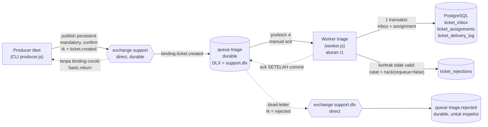

# Diagram arsitektur A05



## Alur acknowledgment satu pesan

```
1. Producer menyimpan envelope bukti/<run>/envelope/<ID>.json, publish, menunggu confirm.
   basic.return (tidak ter-route) → gagal; basic.ack → CONFIRMED.
2. Broker menyimpan pesan persistent di queue durable triage.
3. Worker menerima (unacked), memvalidasi kontrak.
   a. Tidak valid → INSERT ticket_rejections + delivery_log(REJECTED); COMMIT; nack(requeue=false) → triage.rejected.
   b. Valid → BEGIN
             INSERT ticket_inbox(event_id) ON CONFLICT DO NOTHING
             baris baru?  ya → INSERT ticket_assignments (service_queue = classify(category), ASSIGNED)
                          tidak → duplikat, tanpa efek bisnis
             INSERT ticket_delivery_log(outcome)
           COMMIT → ack
4. Worker mati sebelum ack → pesan kembali ready, dikirim ulang (redelivered=true) → langkah 3b
   menemukan inbox sudah ada → DUPLICATE → ack. Tidak ada assignment kedua.
5. Error database → ROLLBACK, TIDAK ack, worker berhenti; pesan kembali ready untuk worker berikutnya.
```

## Identitas dan kunci

| Kunci | Arti | Penjaga |
|---|---|---|
| `event_id` (`<run>-<ID>`) | satu kejadian | PK `ticket_inbox`, PK `ticket_assignments` |
| `ticket_id` (`TKT-<run>-<ID>`) | satu tiket bisnis | UNIQUE `ticket_assignments` |
| `messageId` AMQP | sama dengan `event_id` | dipakai producer mencocokkan return/confirm |
